<h1 align="center">✏️ Girok - The most powerful CLI task manager</h1>

<h3 align="center"> Who said you cannot have a beautiful UI on terminal?</h4>

<p align="center"></img></center>

**Girok**, which means "to record" in Korean, is a **powerful terminal-based task manager** which provides a multitude of scheduling operations that can be done in less than 10 seconds. It also supports **beautiful and responsive calendar GUI** in which you can move around with VIM key bindings.

Girok is running on AWS server so you can **login from any device in the world**!

Girok works fluently with `MacOS` and `Linux` users. It also works with `Windows` but some features and UIs might break.

p.s) Since I launched the project a couple days ago, you might feel a little bit of lag for `showtask` operation, especially when you have many data. I'm working on optimizing the speed to enhance your experience!

# 🤖 Version `0.1.10` is released now!

To see the current version, enter `girok --version`.

### Upgrade with `pip install girok --upgrade`

# 💡 Future Updates (coming soon)

1. 💻 📱 **Web** and **app** which share all the data with CLI.
2. 🔨 Task operations in the calendar view
3. ⏰ **Girok Slack Bot** notification feature for tasks - set an alarm in 5
   seconds!
4. 👪 **Team workspace** where users and create group and invite other people for collaboration

# 📖 Table of Contents

- [🚀 Installation](#-Installation)
- [🔥 Get Started !](#-get-started)
  - [🙏 1. help command](#helpcommand)
  - [🔒 2. Register](#register)
  - [🔓 3. Login / Logout](#loginandlogout)
  - [📚 4. Category commands](#categorycommands)
    - [4.1. `showcat`](#showcatcommand)
    - [4.2. `addcat`](#addcatcommand)
    - [4.3. `mvcat`](#mvcatcommand)
    - [4.4. `rmcat`](#rmcatcommand)
    - [4.5. `rncat`](#rncatcommand)
  - [📕 5. Task Commands](#taskcommands)
    - [5.1. `addtask`](#addtaskcommand)
    - [5.2. `showtask`](#showtaskcommand)
    - [5.3. `done`](#donecommand)
    - [5.4. `chdate`](#chdatecommand)
    - [5.5. `chpri`](#chpricommand)
    - [5.6. `chtag`](#chtagcommand)
    - [5.8. `chname`](#chnamecommand)
    - [5.9. `showtag`](#showtagcommand)
  - [📅 6. Calendar Commands](#calendarcommands)
- [🚒 Report Bugs](#-report-bugs)
- [😭 Uninstall](#-uninstall)
- [💌 Contributions](#-contributions)

# 🚀 Installation

Girok supports all operating systems including Linux, MacOS, Windows.

However, it works well on Unix-based shells such as `bash`, `zsh`, `fish`, `wsl`, etc.

Some shells like `powershell` might break some UIs.

1. Make sure you have Python `>3.9` version installed.
2. Enter the following in your terminal

```bash
pip install girok
```

Now you have installed `girok` on your machine. To make sure that it works, enter the following.

```bash
girok --help
```

Now, let's dive into Girok!

# 🔥 Get Started

## 🙏 1. Help command <a name="helpcommand"></a>

In order to see **all the commands** of **Girok**, enter `girok --help` in your terminal.


In order to see the details of each command, enter the following in your terminal.

```
girok <command> --help
```

For example, if you enter

```
girok addtask --help
```

then you'll see the following help message


## 🔒 2. Register <a name="register"></a>

<p align="center"></img></center>

To register a new account enter the following in your terminal.

```bash
girok register
```

Enter the email address and password and check your mail inbox to get the **verification code**.

Congratulations! Now let's go ahead and login to our account.

## 🔓 3. Login and Logout <a name="loginandlogout"></a>

In order to login with your registered account, enter the following command.

```bash
girok login
```


Now you're ready to use all the features.

## 📚 4. Category Commands <a name="categorycommands"></a>

You can pre-define **categories** such as `School`, `Life` and `Career` with automatically assigned category color.

Girok supports **infinite recursive subcategories**. All the subcategories will be assigned with the color of its topmost parent category.

Later on, you can link tasks to these categories.

### 4.1 `showcat` command <a name="showcatcommand"></a>

In order to see all the categories you have created, enter the following command.

By default, `No Category` category is set (later for tasks which have no category).

```bash
girok showcat
```


### 4.2 `addcat` command <a name="addcatcommand"></a>

`addtask` command takes a single argument `category full path`.

In order to add a new category, enter the following command.

```bash
girok addcat <target path>
```

The `<target path>` is the **full path including the new category name**. For example, if you want to add a **topmost category** named `Career`, then enter

```bash
girok addcat Career
```

Then, you'll see the category tree with the newly created category being highlighted.


In order to nest a sub-category under a previously defined category, pass the **FULL PATH** starting from the topmost category delimited by `/`, ending with the new category name.

For example, if you want to create a new category named `Resume` under the previously created `Career` category, enter the following command.

```bash
girok addcat Career/Resume
```

Then, you'll see `Resume` is created under `Career`.


In this way, you can create as many categories and sub-categories as you want!

### 4.3 `mvcat` command <a name="mvcatcommand"></a>

Now you might want to move a category under another category.

In order to move a `category A` (recursively all its sub-categories) under `category B`, enter the following command.

```bash
girok mvcat <full path of A> <full path of B>
```

For example, if you want to move the whole `Career` category under `Dev/Network` (for some weird reason), enter the following command.

```bash
girok mvcat Career Dev/Network
```


If you want to move a category to the `root category`, then pass `/` as the second argument. Let's move `Dev/Network/Career` back to the topmost category.

```bash
girok mvcat Dev/Network/Career /
```


### 4.4 `rmcat` command <a name="rmcatcommand"></a>

Of course, you want to delete a category. In that case, enter the following command.

```bash
girok rmcat <full path of category>
```

Let's add a dummy category named `Dummy` under `Dev` then remove it.

As you already know, enter

```bash
girok addcat Career/Dummy
```


Now, let's delete it with the following command.

**[WARNING]** If you delete a category, **all its sub-categories and tasks will be DELETED**. I'll consider adding an option for users to preserve all the orphan tasks in the future. Please let me know in the issue if you need this feature!

```bash
girok rmcat Career/Dummy
```

Then, you'll be asked to confirm the deletion. Enter `y`.


### 4.5 `rncat` command <a name="rncatcommand"></a>

To rename an existing category,

```bash
girok rncat <category path> <new name>
```

Great job! Now let's move on to the task commands.

## 📕 5. Task commands <a name="taskcommands"></a>

**Girok** provides powerful task scheduling operations. You can perform different operations that would've taken a long time in other schedulers like Notion and Google Calendar in less than 10 seconds (If you get used to the commands).

### 5.1 `addtask` command <a name="addtaskcommand"></a>

```bash
girok addtask <task name> [One of deadline date options] [-c | --category <category path>] [-p | --priority <priority>] [-t | --time <deadline time>] [-T | --tag <tag name>]
```

It looks quite complicated but don't worry! Let's go through some rules.

#### 5.1.1 `addtask` rules

1. `<task name>` (Argument / **Required**) - If the task name has no space you can omit double quotes `""`. If it does, enclose the task name by double quotes `""`
2. `<One of date options>` (Option / **required**) - You must specify a **deadline "date"** of a task. There're many ways to add a deadline. Note that **ONLY ONE DATE OPTION** is allowed.
   - `-d <yyyy/mm/dd | mm/dd>`
     - Specify an exact date delimited by `/`. You can enter the full date in the form of `yyyy/mm/dd`. Or, you can omit the year like `mm/dd` then the deadline year will be set to the current year.
     - You don't have to enter the exact form filled with `0`s. If the month is May, then just enter `5/23` or `05/23`.
   - `-t1 ~ -t7 | --thismon ~ --thissun`
     - Sometimes, you're not aware of the exact date. If the date is some weekday of this week, you can just pass `-t{1-7}` referrting to this monday to this sunday (monday indexed as `1`).
     - For example, if the deadline is this friday, enter `girok addtask "dummy" -t5`
   - `-n1 ~ -n7 | --nextmon ~ --nextsun`
     - Similar to the above but referring to **next week**.
   - `-a <# days>`
     - Sometimes, you process the deadline in your mind like "it's due 5 days later".
     - In this case, pass the number of days a task is due after.
     - For example, if the deadline is 5 days later, enter `girok addtask "dummy" -a 5`
   - `--tdy`
     - Set the deadline to today.
   - `--tmr`
     - Set the deadline to tomorrow.
3. `-t | --time <hh:mm>` (Option, **Optional**) - You can also set the specific deadline time.
   - You must provide the full time format in **24 hour scale** such as `07:23` or `21:59`.
4. `-c | --category <category full path>` (Option / **Optional**) - Your tasks might belong to a specific category you have previously defined.
   - Provide the **full category path**.
   - For example, if your task belongs to `Career/Resume`, then enter `girok addtask "dummy task 1" --tmr -c Career/Resume`.
   - If you specify a category, then the task color will be automatically linked to that category's color.
   - If no category is provided, the task will belong to `No Category` category.
5. `-p | --priority <priority (1~5)>` (Option, **Optional**) - You can set the priority of a task so that you can filter out by priority when you query your tasks.
   - For example, to set the priority of a task as `5`, enter `girok addtask "dummy task 1" -c Career/Resume -p 5`.
6. `-T | --tag <tag name>` (Option, **Optional**) - You can set the **tag**(or type) of a task such as `assignment` and `meeting`. With tags, you can more efficiently query your tasks with different types.
   - Unlike category, tag doesn't allow nested tags and you don't have to pre-define them.
   - For example, if you want to set the tag of a task as `assignment`, enter `girok addtask "assignment 4" -c HKU/COMP3234 -d 4/24 --tag assignment`

In summary, keep the following rules in mind.

1. Always provide **task name** and **one of date options**.
2. Although not required, I think it's better to provide **category** to manage your tasks more effectively.
3. Other options are up to you!

For example, the following command is a typical command that I use on everyday basis.

```bash
girok addtask "Implement tag filtering feature" -c Dev/Girok -a 3 -p 5
```

It looks quite complicated, but you'll get used to it quickly after playing out little bit.

#### 5.1.2 `addtask` demonstration

Now let's play around with `addtask` command.

Recall our category list is

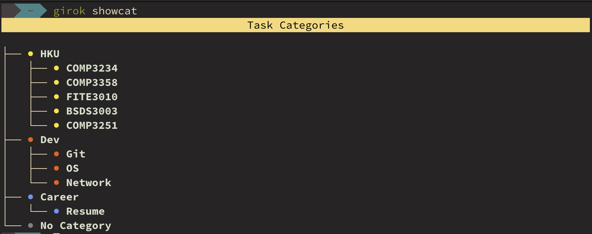

In the demonstration, I will add several tasks and show how it works.

Let's add a task named `go over resume again` whose category is `Career/Resume` and I will do it by `next thursday`. This is a quite important task, so I will assign the `priority` of `5`.

```bash
girok addtask "go over resume again" -c Career/Resume -n4 -p 5
```

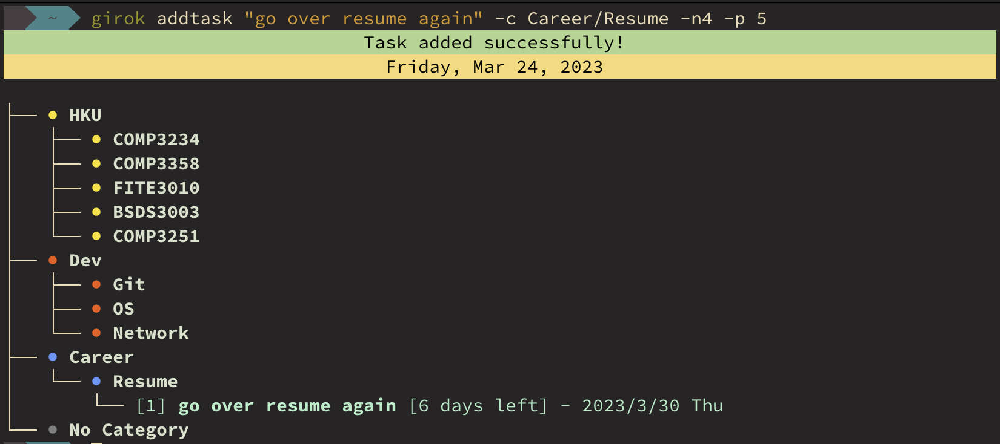

When adding it, you will see the same category tree with tasks attached to the belonged category. (Priority is now shown by default. You can see the priority with `girok showtask` command we'll talk about very soon).

Now I'll add another task named `Midterm exam` with the category `HKU/COMP3234` and the deadline is `4/18 09:30`. Hmm.. I think I have plenty of time so I will not provide the priority. However, I will assign the tag `exam`.

```bash
girok addtask "Midterm exam" -c HKU/COMP3234 -d 4/18 -t 09:30 --tag exam
```

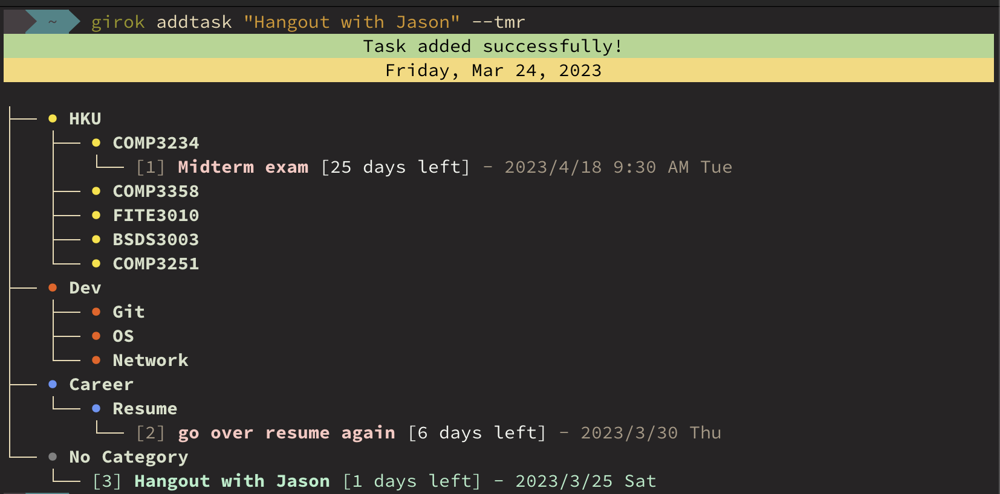

In the tree view, priority and tag are not shown to avoid complexity. Don't worry! You can view all the information when we go into `girok showtask` command.

Lastly, I'll add a task named `Hangout with Jason` and the appointment date is `tomorrow`. This time, I will not provide any option.

```bash
girok addtask "Hangout with Jason" --tmr
```


Notice that the newly added task is highlighted with green color.

### 5.2 `showtask` command. <a name="showtaskcommand"></a>

```bash
girok showtask [--tree] Deadline date options] [-c | --category <category path>] [-p | --priority <priority>] [-T | --tag <tag name>]
```

Girok provides powerful commands to effectively query your schedule with many different options. You can filter tasks by category, priority, deadline, and tag.

#### 5.2.1 View options

You can type `girok showtask` command with no parameter. The default view of the command is **list view**.

Note that I've added some more tasks to make the visualization rich.

```bash
girok showtask
```

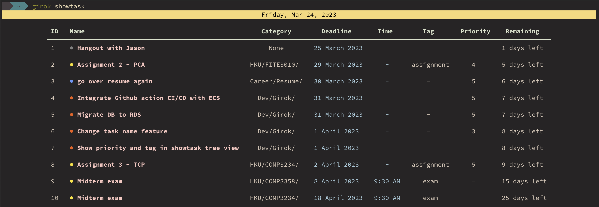

By default, all tasks will be shown in a nice table format.

If you want to view your tasks in a categorized manner, then provide `--tree` flag.

```bash
girok showtask --tree
```

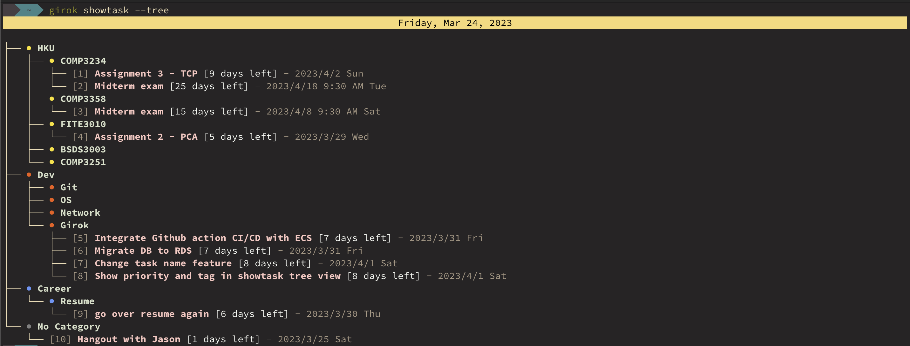

#### 5.2.2 Filter by category

To query tasks under a specific category, use the following command,

```bash
girok showtask -c <category path>
```

For example, to query tasks only for the `HKU` category. Enter the following command.

```bash
girok showtask -c HKU
```

or

```bash
girok showtask -c HKU --tree # tree view
```

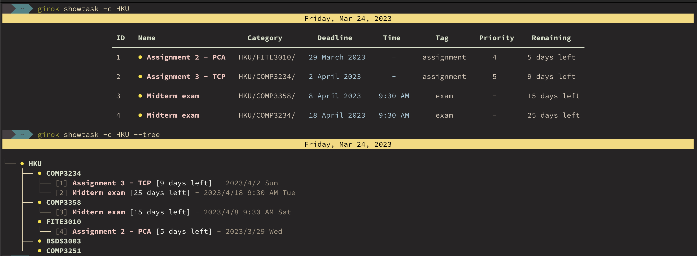

#### 5.2.3 Filter by date options

You can query your tasks filtering by many different date options. Notice that all the options for `showtask` command are **OPTIONAL**.

1. `-e | --exact <yyyy/mm/dd | mm/dd>`
   - To view tasks due to a specific day, provide the exact date after the flag
2. `-d | --day <# days>`
   - To view tasks due **within `n` days**, provide the number of days `n` after the flag
3. `-w | --week <# days>`
   - To view tasks due **within `n` weeks**, provide the number of weeks `n` after the flag
4. `-m | --month <# days>`
   - To view tasks due **within `n` months**, provide the number of months `n` after the flag
5. `--tdy`
   - To view tasks due today.
6. `--tmr`
   - To view tasks due within tomorrow (today && tomorrow)
7. `--tw`, `--nw`
   - To view tasks due within this week and next week, respectively
8. `--tm`, `--nm`
   - To view tasks due within this month and next month, respectively
9. `-t1 ~ -t7 | --thismon ~ --thissun`
   - To view tasks due **exactly** the weekday of this week
   - Monday is indexed as `1`
10. `-n1 ~ -n7 | --nextmon ~ --nextsun`

- To view tasks due **exactly** the weekday of next week
- Monday is indexed as `1`

11. `-u | --urgent`

- To view urgent tasks that are within `3 days` by default

#### 5.2.4 Filter by priority

```bash
girok showtask -p <priority (1~5)>
```

To view tasks with a specific priority, provide `-p` option followed by the priority number between `1` and `5`.

For example, to view tasks with priority 5, enter the following command

```bash
girok showtask -p 5
```


To view tasks with priority 5, but with **tree view**, enter the following command.

```bash
girok showtask -p 5 --tree
```


#### 5.2.5 Filter by tag

```
girok showtask [-T | --tag <tag name>]
```

### 5.3 `done` command <a name="donecommand"></a>

To complete(delete) a task, provide the `done` command followed by the task ID.

```
girok done <task ID>
```

**[IMPORTANT]** The **TASK ID** is the IDs you can see when you perform `showtask` operations. Note that the **ONLY the Task IDs of the LATEST showtask operation are valid**. In other words, if you consecutively type `girok showtask` and `girok showtask -p 5` but try to delete a task with the task IDs shown in the table of the first `girok showtask` command, you might delete an unexpected task!!

For example, suppose you enter `girok showtask` command.


If you completed the task `Migrate DB to RDS` under `Dev/Girok` category, provide the task ID at the leftmost column.

```bash
girok done 5
```

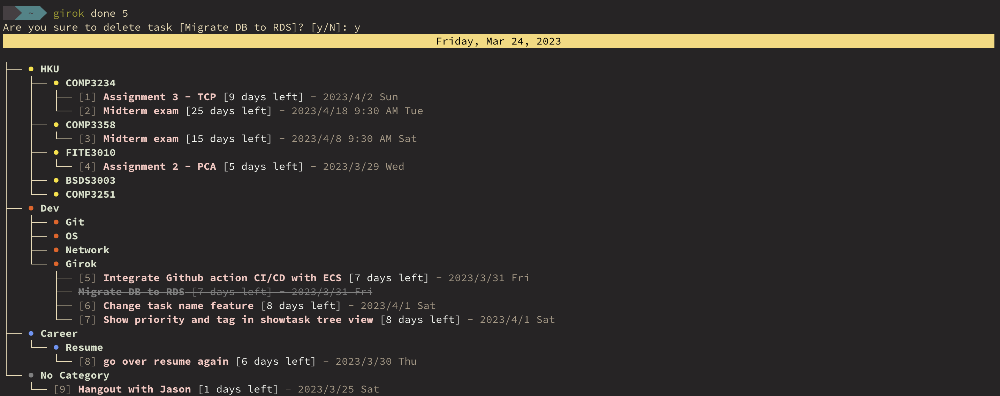

Notice that the task is now striked out.

### 5.4 `chdate` command <a name="chdatecommand"></a>

To change the date of an existing task, enter the following command.

```bash
girok chdate <taskID> <yyyy/mm/dd | mm/dd>
```

### 5.5 `chpri` command <a name="chpricommand"></a>

To change the priority of an existing task, enter the following command.

```bash
girok chpri <taskID> <priority (1~5)>
```

### 5.6 `chtag` command <a name="chtagcommand"></a>

To change the tag of an existing task, enter the following command.

```bash
girok chtag <taskID> <tag name>
```

### 5.7 `chname` command <a name="chnamecommand">

To change the name of an existing task, enter the following command.

```bash
girok chname <taskID> <new task name enclosed with "">
```

### 5.8 `showtag` command <a name="showtagcommand"></a>

To view all the tags you have created so far, enter the following command.

```bash
girok showtag
```

## 📅 6. Calendar Commands <a name="calendarcommands"></a>

The beauty of **Girok** is the **beautiful and responsive full calendar GUI**.

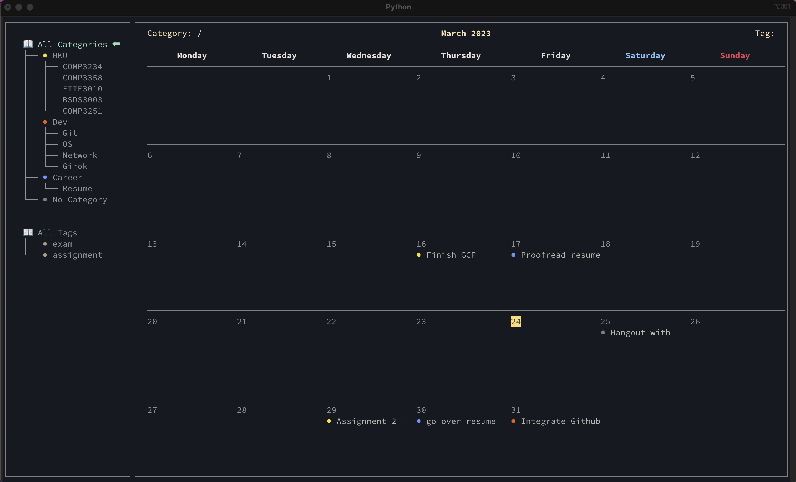

To fire up the calendar, enter the following command

```
girok cal
```

Then you'll be prompted to the calendar GUI.

**girokcal** offers a beautiful but minimalistic GUI in which you can move around with (not exactly same but similar) **VIM key bindings**.

Notice that all the categories and tags we have created so far are linked to the **sidebar**.

### 6.1 Moving around calendar


Upon `girok cal` command, the starting **"focus"** is the **category tree**.

- Select a category/tag
  - `o` - select the current category/tag
- Move inside **category tree** or **tag tree**
  - `j` - down
  - `k` - up
- Move from **category tree** to **tag tree**
  - `ctrl + j`
- Move from **tag tree** to \*\_category tree
  - `ctrl + k`
- Moving from **category tree** or **tag tree** to **calendar**
  - `e`
- Moving from **calendar** to back **sidebar** (to category tree by default)
  - `w`
- Move inside the **calendar**
  - `h` - left
  - `j` - down
  - `k` - up
  - `l` - right
- Select a **calendar cell** (day) to view details
  - `o` - select the currently focused calendar cell
- **Next month**
  - `i`
- **Previous month**
  - `u`
- **Direct to the current month**
  - `y`
- **Toggle side bar**
  - `f`
- **Close calendar**
  - `q`

### 6.2 Calendar Demonstrations

When you click on a category, then the category title will change accordingly at the left-bottom corner of the calendar. All the tasks belonging to the selected category will be shown.

Let's select `HKU` category by pressing alphabet `o` key.

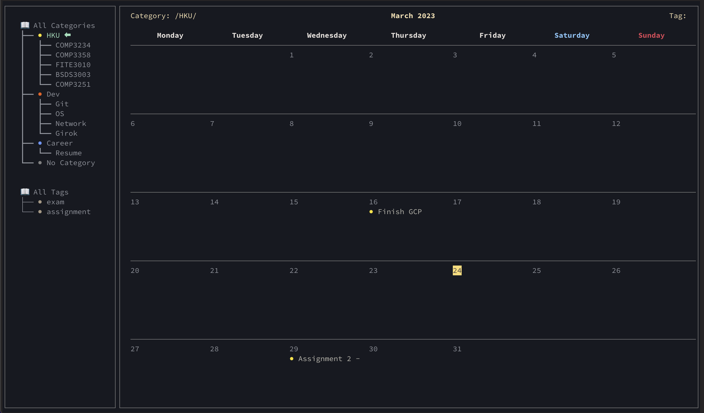

Notice that only the tasks with the yellow dots (HKU category color) are shown.

Now let's select `All Categories` and change our focus from the **category tree** to the **tag tree** by pressing `ctrl+j` key. Then, select `exam` tag.

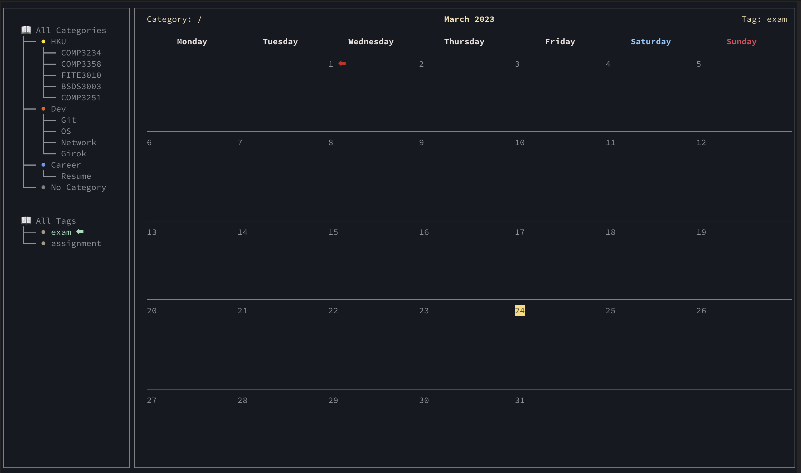

Yay! I don't have any exams this month.

But.. do I have exams next month? To check it out, let's press `i` to move to the next month.

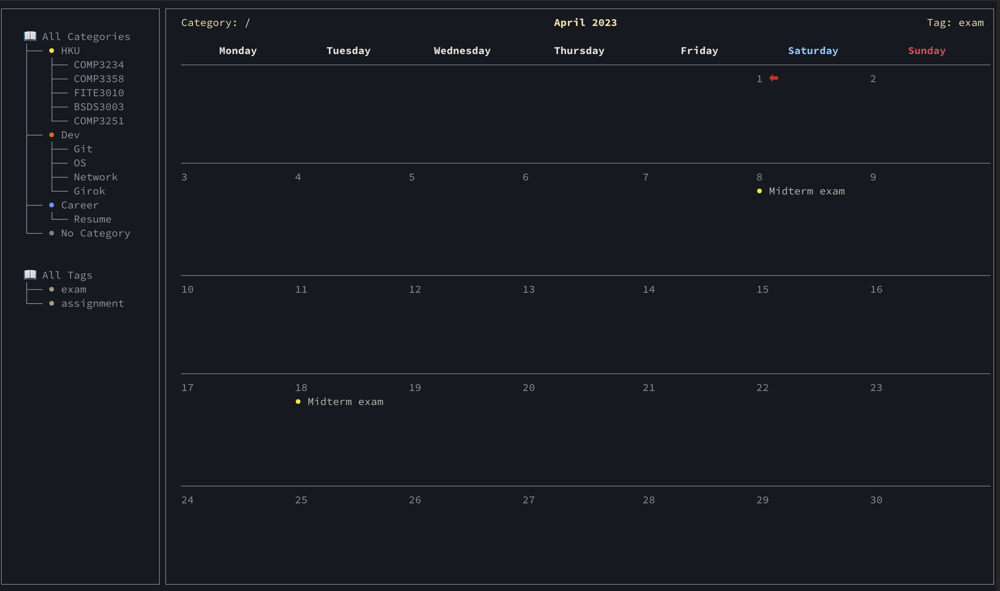

Lastly, let's press `f` to close the sidebar to have make the calendar bigger.


Great job! Now, it's time to explore all the features of **Girok** on your own!!

# 🚒 Report Bugs

The first version of **Girok** was released just a couple days ago so you might encounter some bugs and errors.

If so, I'd greatly appreciate if you report them as raising `issues` then I will respond and update as soon as possible!!

# 😭 Uninstall

I'm sorry that there's no way to uninstall this package.

Just kidding. Enter `pip uninstall girok` in your terminal. Bye..😢

# 💌 Contribute to the project

If you have any new features that would make your life easier, please don't hesitate to raise issues.

If you wish to contribute to the project as a programmer, drop pull requests and I will review each of them carefully!
