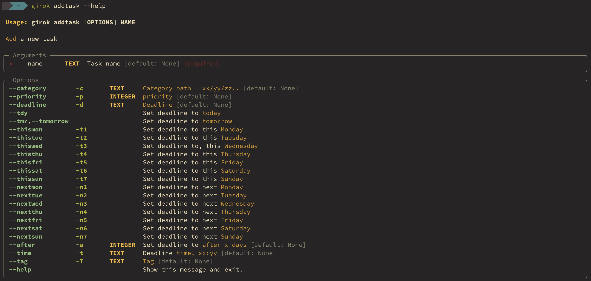

contents

1. Girok Intro
2. Version Info
3. Table of contents
   1. Installation
   2. Commands
      1. `--help`
      2. Auth
      3. Category
      4. Task
      5. Calendar
   3. Use cases
   4. Major Updates Plan
   5. Troubleshooting
   6. Uninstall
   7. Contributions

<h1 align="center">✏️ Girok - The most powerful CLI task manager</h1>

<h3 align="center"> Who said you cannot have a beautiful UI on terminal?</h4>

Girok is a **powerful terminal-based task manager** which provides a multitude of scheduling operations that can be done in less than 10 seconds. It also supports **beautiful and responsive calendar GUI** in which you can move around with VIM key bindings.

Girok is running on AWS server so you can **login from any device in the world**!

# 📀 Version `0.1.6` is released now!

### Upgrade with `pip install girok --upgrade`

# 📖 Table of Contents

- [🚀 Installation](#-Installation)
- [🔥 Get Started](#-get-started)
  - [1. help command](#help-command)
  - [2. Register](#register)
  - [3. Login / Logout](#login-and-logout)
  - [4. Category commands](#category-commands)
  - [5. Task Commands](#task-commands)
  - [6. Calendar Commands](#calendar-commands)
- [📝 Use cases](#-use-cases)
- [🤖 Major updates plan](#-major-updates-plan)
- [🚒 Troubleshooting](#-troubleshooting)
- [😭 Uninstall](#-uninstall)
- [💌 Contributions](#-contributions)

# 🚀 Installation

Girok supports all operating systems including Linux, MacOS, Windows.

However, it works well on linux-based shells such as `bash`, `zsh`, `fish`, `git-bash`, etc.

Some shells like `powershell` might break some UIs.

1. Make sure you have Python `>3.9` version installed.
2. Enter the following in your terminal

```bash
pip install girok
```

Now you have installed `girok` on your machine. To make sure that it works, enter the following.

```bash
girok --help
```

Now, let's dive into Girok!

# 🔥 Get Started

## 1. Help command

In order to see **all the commands** of **Girok**, enter `girok --help` in your terminal.


In order to see the details of each command, enter the following in your terminal.

```
girok <command> --help
```

For example, if you enter

```
girok addtask --help
```

then you'll see the following help message



## 2. Register

To register a new account enter the following in your terminal.

```bash
girok register
```


Congratulations! Now let's go ahead and login to our account.

## 3. Login and Logout

In order to login with your registered account, enter the following command.

```bash
girok login
```


Now you're ready to use all the features.

## 4. Category Commands

You can pre-define **categories** such as `School`, `Life` and `Career` with automatically assigned category color.

Girok supports **infinite recursive subcategories**. All the subcategories will be assigned with the color of its topmost parent category.

Later on, you can link tasks to these categories.

### 4.1 `showcat` command

In order to see all the categories you have created, enter the following command.

By default, `No Category` category is set (later for tasks which have no category).

```bash
girok showcat
```


### 4.2 `addcat` command

`addtask` command takes a single argument `category full path`.

In order to add a new category, enter the following command.

```bash
girok addcat <target path>
```

The `<target path>` is the **full path including the new category name**. For example, if you want to add a **topmost category** named `Career`, then enter

```bash
girok addcat Career
```

Then, you'll see the category tree with the newly created category being highlighted.


In order to nest a sub-category under a previously defined category, pass the **FULL PATH** starting from the topmost category delimited by `/`, ending with the new category name.

For example, if you want to create a new category named `Resume` under the previously created `Career` category, enter the following command.

```bash
girok addcat Career/Resume
```

Then, you'll see `Resume` is created under `Career`.


In this way, you can create as many categories and sub-categories as you want!

### 4.3 `mvcat` command

Now you might want to move a category under another category.

In order to move a `category A` (recursively all its sub-categories) under `category B`, enter the following command.

```bash
girok mvcat <full path of A> <full path of B>
```

For example, if you want to move the whole `Career` category under `Dev/Network` (for some weird reason), enter the following command.

```bash
girok mvcat Career Dev/Network
```


If you want to move a category to the `root category`, then pass `/` as the second argument. Let's move `Dev/Network/Career` back to the topmost category.

```bash
girok mvcat Dev/Network/Career /
```


### 4.4 `rmcat` command

Of course, you want to delete a category. In that case, enter the following command.

```bash
girok rmcat <full path of category>
```

Let's add a dummy category named `Dummy` under `Dev` then remove it.

As you already know, enter

```bash
git addcat Career/Dummy
```


Now, let's delete it with the following command.

```bash
girok rmcat Career/Dummy
```

Then, you'll be asked to confirm the deletion. Enter `y`.


Great job! Now let's move on to the task commands.

## 5. Task commands

## 6. Calendar Commands

# 📝 Use Cases

# 🤖 Major updates plan

# 🚒 Troubleshooting

# 😭 Uninstall

# 💌 Contributions
